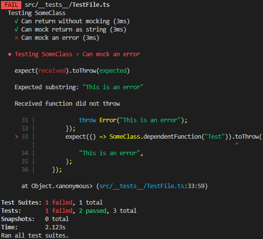

# Issue in ts-mock-imports

## Expected Outcome

When mocking a function, its returned value is some user-defined value decided in the test.  
I wish to throw an error instead of returning a value, and see that I caught it in jest.

## Issue

Mocking a function that usually returns a normal value, to throw an error instead, does not work.

### Install

```sh
npm i
```

### Usage

```sh
npm t
```

### Error Log


